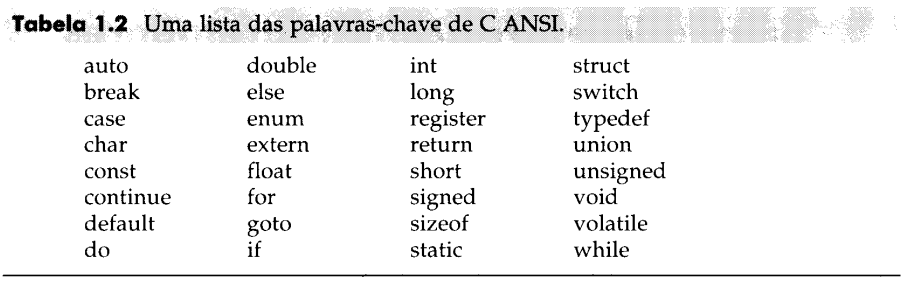
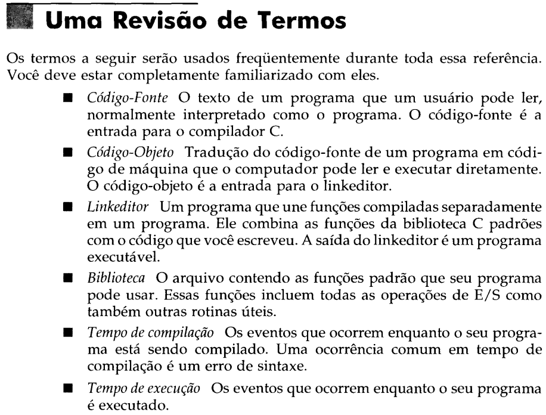
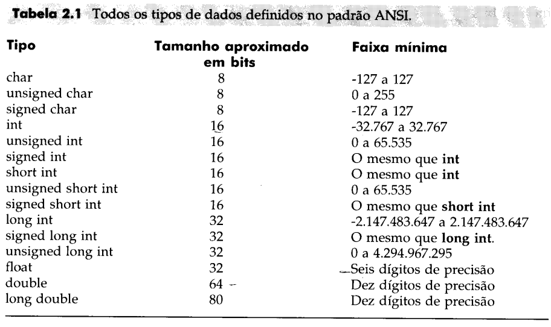

# C Completo e Total - 3ª Edição

## Tabela com a lista de palavras chaves do C

## Revisão dos termos explicados no primeiro capítulo

## Os cinco tipos básicos de dados

1. char
2. int
3. float
4. double
5. void

